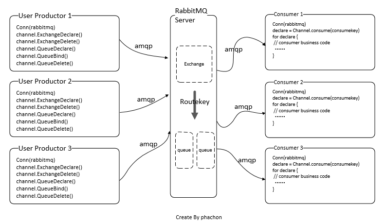
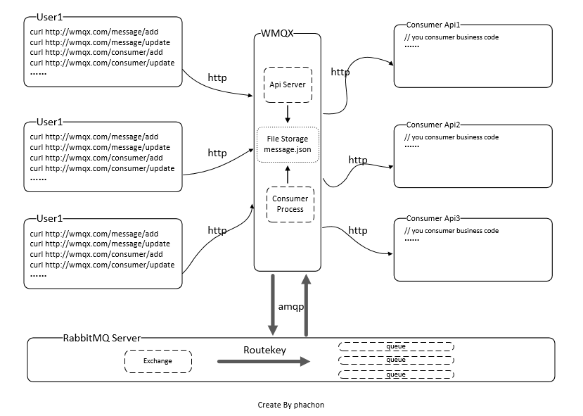

[](https://github.com/phachon/wmqx)

[](https://github.com/phachon/wmqx/) 
[](https://travis-ci.org/phachon/wmqx)
[](https://godoc.org/github.com/phachon/wmqx)
[](https://raw.githubusercontent.com/phachon/wmqx/master/LICENSE)
[](https://goreportcard.com/report/github.com/phachon/wmqx)
[]()
[](https://github.com/phachon/wmqx/releases) 
[](https://github.com/phachon/wmqx/releases) 

WMQX 是一个基于 RabbitMQ 开发的支持 http 协议的 MQ 服务, 他的前身是 [wmq](https://github.com/snail007/wmq), 感谢他的作者同时也是我的好友 [snail007](https://github.com/snail007) , 当然，你也可以理解为 WMQX 是 wmq 的升级版。

## 为什么需要 WMQX?

### RabbitMQ 的使用
RabbitMQ 是一个轻量级的，易于部署在本地和云上，支持多个消息传递协议的消息队列中间件。RabbitMQ 可以应用于许多的场景中，同时也支持多种语言的 SDK。通常你会这样使用 RabbitMQ：
 
1. 作为生产者：
    - 编写代码连接到 RabbitMQ，并打开一个 channel。
    - 编写代码声明一个 exchange，并设置相关属性。
    - 编写代码声明一个 queue，并设置相关属性。
    - 编写代码使用 routing key，在 exchange 和 queue 之间建立好绑定关系。
    - 编写代码发送消息到 RabbitMQ。
2. 作为消费者：
    - 编写代码连接到 RabbitMQ，并打开一个 channel, 开启消费进程，等待接收到消息后，处理消费的业务逻辑。
    
如下图所示：
[](https://github.com/phachon/wmqx)

### 遇到的问题：
1. RabbitMQ 的连接、Exchange、Queue 的声明和修改和业务代码耦合在一起，增加了开发和维护的成本。
2. 当修改消费者的业务逻辑，可能会需要频繁的重启消费进程。
3. 对于第一次使用 MQ 的用户，去理解 RabbitMQ 的原理和编写代码实现生产和消费是需要一定的时间和人力成本。
4. 。。。

### 解决与实现：
1. 将 RabbitMQ 的连接、Exchange、Queue 的声明和修改删除等一些和业务无关的操作抽离出来单独提供服务，Exchange、queue 的操作以友好的 API 的方式提供给用户。
2. 帮助用户去实现每一个消息的消费进程，用户只需要提供消费者的 API 接口，消费进程等待有消息后调用对应的消费者 API。消费者业务逻辑修改，只需要修改 API, 消费进程无需重启。
3. 对于第一次使用 MQ 或者不清楚 RabbitMQ 原理的用户，不需要去深入了解 RabbitMQ 的使用和编码实现，只需要通过 http 的方式接入服务，即可快速使用消息队列。 

> 所以 WMQX 也就由此诞生。工作原理如下图所示：

[](https://github.com/phachon/wmqx)

## 功能
1. 无需关心消息队列的工作方式，提供高性能，高可用的 http 接口来对消息进行管理
2. 帮助用户实现消费进程，只需要通过接口添加对应的消费者 api 即可实现消费或消息推送
3. 每一个消费者由单独的 goroutine 处理，消费者相互独立
4. 部署简单方便，支持跨平台部署
5. 提供一套完善的后台管理 UI, 项目 [WMQX-UI](https://github.com/phahcon/wmqx-ui)

## 安装
```go

```

## 使用
```go

```

# 文档

# 示例

[一些例子](_examples)

## 反馈

- 如果您喜欢该项目，请 [Start](https://github.com/phachon/wmqx/stargazers).
- 如果在使用过程中有任何问题， 请提交 [Issue](https://github.com/phachon/wmqx/issues).
- 如果您发现并解决了bug，请提交 [Pull Request](https://github.com/phachon/wmqx/pulls).
- 如果您想定制开发，欢迎 [Fork](https://github.com/phachon/wmqx/network/members).
- 如果你想交个朋友，欢迎发邮件给 [phachon@163.com](mailto:phachon@163.com).

## License

MIT

Thanks
---------
Create By phachon@163.com